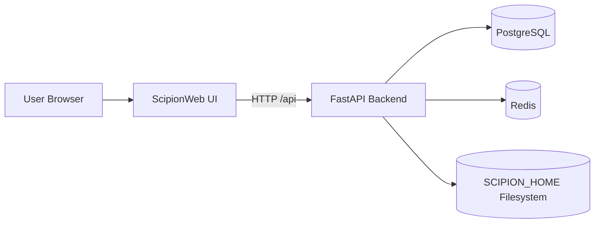
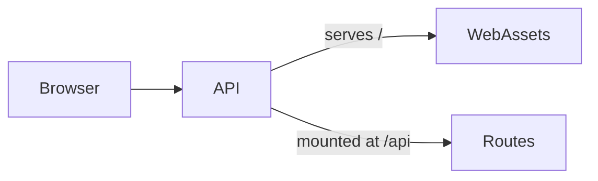
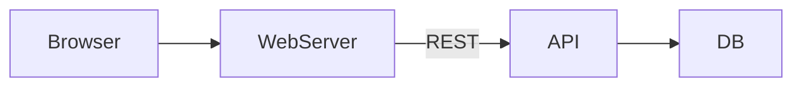
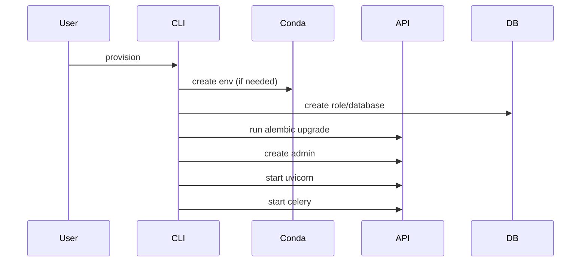

# Architecture

ScipionWeb is composed of three main layers:

- Web Frontend (React / Vite)
- FastAPI Backend (ScipionAPI)
- Infrastructure Layer (PostgreSQL + Redis + Filesystem)

---

# High-Level Architecture

---

# Runtime Components

## FastAPI

- Exposes REST API
- Handles authentication (JWT)
- Serves preview endpoints
- Optionally serves compiled Web UI
- Initializes Scipion runtime environment

## Celery Worker

- Background tasks (plugin install, heavy operations)
- Uses Redis as broker + result backend

## PostgreSQL

Stores:

- Users
- Projects
- Protocols
- Project sharing
- Settings
- Tags

## Filesystem (SCIPION_HOME)

Contains:

- projects/
- logs/
- config/
- web/dist (if integrated mode)
- .env

---

# Integrated Mode

When `--web-dist` is provided during provisioning:

- Web is served at `/`
- API is mounted at `/api`
- API docs at `/api/docs`

---

# API-Only Mode

- Frontend hosted separately (e.g., nginx)
- API served independently
- Cross-origin requests enabled

---

# Startup Flow

---

# Port Usage

Default ports:

- API: 8080
- PostgreSQL: 5432
- Redis: 6379

---

# Security Model

- JWT authentication
- HS256 signature
- SECRET_KEY stored in `.env`
- Access tokens use `sub=email`

Production recommendation:

- Use HTTPS
- Reverse proxy (nginx)
- Rotate SECRET_KEY
