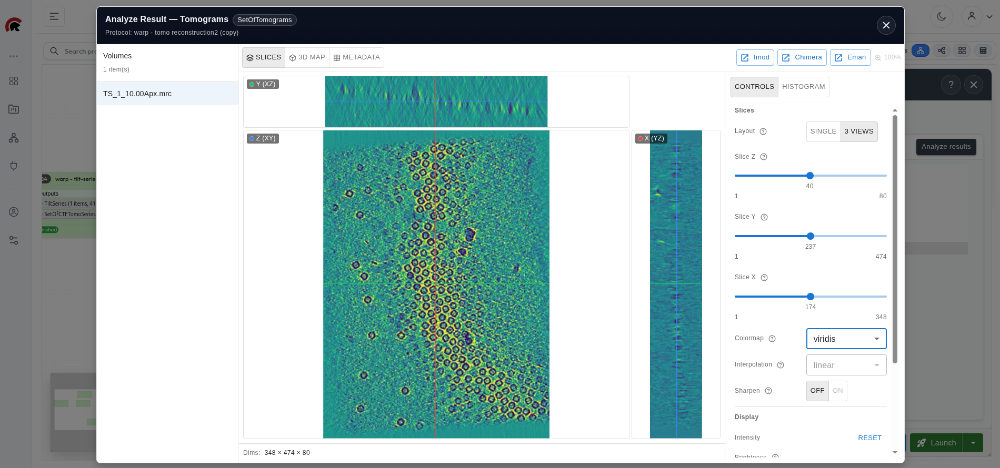
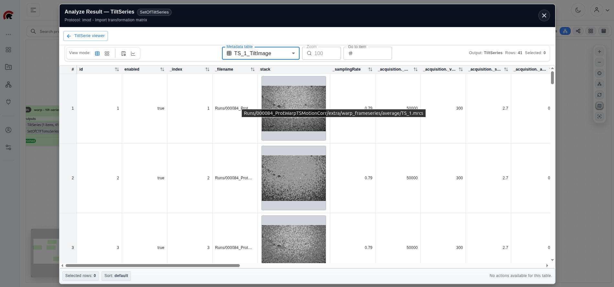

# Outputs and Viewers

This page explains how to inspect protocol results in ScipionWeb and how to decide whether a workflow can continue safely.

---

## Typical output workflow

After a protocol finishes, you will usually:

1. locate the generated outputs in the protocol card, protocol details, or output area
2. confirm that the protocol finished successfully
3. open the relevant preview or viewer
4. inspect the data in the context of the project and protocol history
5. decide whether a downstream protocol can use that output

---

## Open an output

1. Open the project that contains the protocol run.
2. Locate the protocol that produced the result.
3. Check that the protocol status is finished or otherwise suitable for inspection.
4. Locate the output you want to review.
5. Open the preview or viewer action associated with that output.
6. Confirm that the viewer content matches the expected output type.

*Outputs can be opened from the project context using the available viewer actions.*

Before assuming a viewer is broken, confirm that:

- the protocol completed successfully
- the selected output belongs to the expected run
- the viewer matches the output type
- browser and backend requests are succeeding

---

## Common viewer expectations

Different output types may open different viewers or previews.

Typical examples include:

- metadata tables or galleries
- volume viewers
- coordinate viewers
- tilt-series viewers
- CTF tomography viewers
- generic file previews

*Metadata outputs can be inspected in a table-oriented viewer.*

The exact viewer depends on the output class and the backend data available for that output.

---

## While inspecting results

Review outputs with these questions in mind:

- is this the expected result for the current workflow step?
- does the output belong to the intended protocol execution?
- are there obvious signs that the run failed or produced incomplete data?
- do follow-up protocols now have the inputs they need?

Outputs are most useful when interpreted as part of a workflow, not as isolated files detached from the protocol history.

---

## Use outputs as downstream inputs

Before selecting an output as input for another protocol:

1. verify that the output belongs to the intended project and protocol run
2. inspect it if the output type has a useful viewer
3. confirm that the output type is compatible with the downstream protocol parameter
4. avoid selecting similarly named outputs from older runs by mistake

This is especially important in projects with repeated runs, duplicated protocols, or several similar outputs.

---

## If a viewer does not open

Check the following first:

- failed browser network requests
- missing backend viewer data
- stale frontend state after route changes
- incomplete protocol execution
- whether the selected output still corresponds to the visible protocol state

Useful recovery steps:

1. refresh the project view
2. reopen the protocol details
3. try the viewer again
4. inspect browser network errors
5. check API logs if the viewer request fails server-side

---

## Good practice

When possible:

- review outputs soon after execution finishes
- compare what you see with what the workflow stage should produce
- confirm that downstream steps are using the intended outputs
- avoid relying only on memory when multiple similar runs exist in the same project
