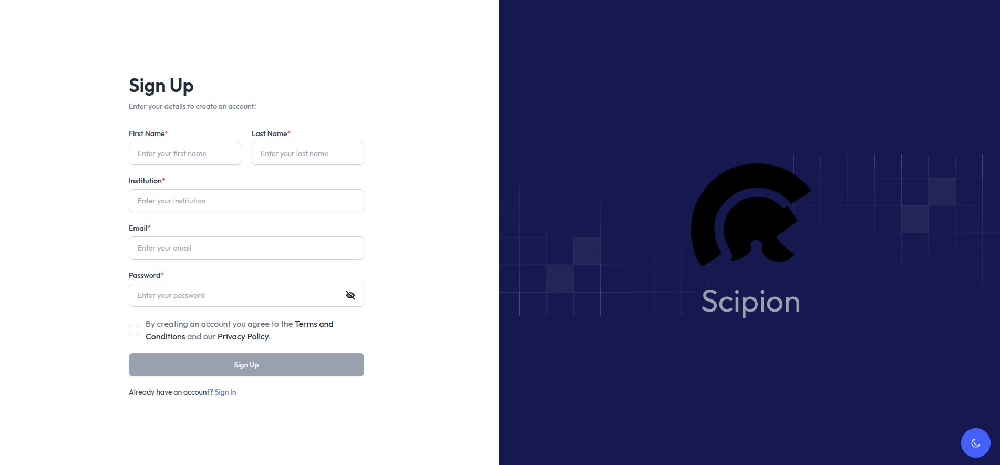

---
hide:
  - toc
---

# Sign Up

Use this page when you need to create a new ScipionWeb account before signing in for the first time.

!!! note "Account availability"
    Some ScipionWeb instances may disable public sign-up. If you do not see the sign-up option, ask the instance administrator to create your account or enable registration.

---

## When to use sign-up

Use the sign-up form when:

- you are accessing a ScipionWeb instance for the first time
- an administrator has asked you to create your own user account
- your institution or team uses self-registration for new users

If you already have credentials, go directly to [First Login and Session Basics](../first-login/).

---

## Open the sign-up page

From the login screen, choose the sign-up option to open the registration form.

*ScipionWeb sign-up page used to create a new user account.*

---

## Fill in your account details

Complete the required fields in the form. Depending on the instance configuration, the form may request information such as:

- username
- email address
- password
- password confirmation

Use an email address that administrators can recognize, especially on shared facilities or institutional deployments.

---

## Submit the form

After submitting the form, one of these outcomes is expected:

- your account is created and you can continue to the login page
- your account requires administrator approval
- registration is rejected because sign-up is disabled or restricted

If approval is required, wait for the administrator to activate or approve the account before trying to sign in.

---

## After creating the account

Continue with:

1. [First Login and Session Basics](../first-login/)
2. [Projects](../projects/)
3. [Protocol Execution](../protocols/)

The first successful login confirms that the account is valid and that the browser session was created correctly.

---

## Common sign-up problems

### The sign-up option is not visible

The instance may not allow self-registration. Contact the administrator and ask whether accounts are created manually.

### The email or username is already in use

Try signing in with the existing account. If you do not remember the credentials, ask the administrator for help.

### The password is rejected

Check the password rules shown by the form. Some deployments may enforce minimum length or other password requirements.

### The account was created but login fails

The account may still require approval, or the instance may have a configuration issue. Ask the administrator to verify that the account is active.

---

## Good practices

- Use a recognizable username or email address.
- Do not share accounts between users.
- Keep your password private.
- Confirm that you are signing up on the intended ScipionWeb instance.
- Use separate accounts for local, staging, and production instances when required.
